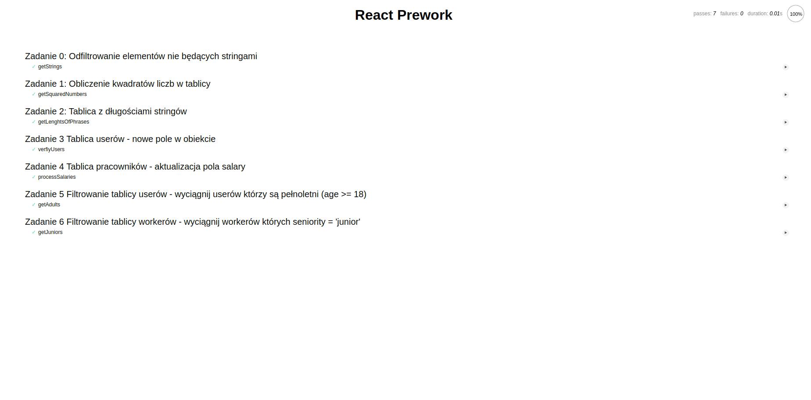

# React Prework

Repozytorium zawiera parę zadań z JavaScriptu. Zadania te są dobra rozgrzewką przed zajęciami z reacta.

## Oczekiwany rezultat po uruchomieniu projektu i wykonaniu wszytskich zadań



## Jak uruchomić projekt

Najprostszym sposobem na uruchomienie projektu jest przeciągnięcie pliku HTML do okna przeglądarki.
Oprócz tego możesz użyć rozszerzenia VSCodowego live server.
Trzecią metodą na uruchomienie projektu jest wywołanie skryptu/komendy w terminalu w folderze z projektem.
Projekt powinien się uruchomić na porcie 3000

```bash
  npm start
```
